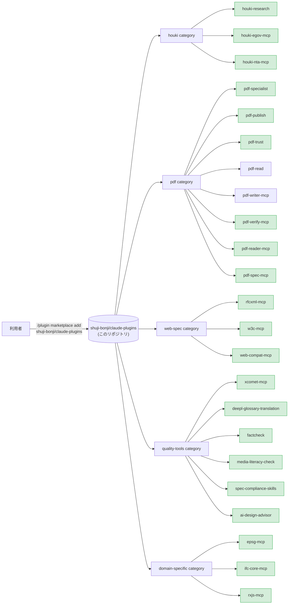

# shuji-bonji's Claude Plugins

[](https://opensource.org/licenses/MIT)

[English](./README.md)

[shuji-bonji](https://github.com/shuji-bonji) が公開する **Claude 拡張 (Skill / MCP server / slash command / sub-agent) の marketplace**。Claude Code と Cowork の両方から `/plugin install` で利用できます。

> Anthropic 公式の [`anthropics/claude-plugins-official`](https://github.com/anthropics/claude-plugins-official) と同じ form factor。`.claude-plugin/marketplace.json` を catalog として、複数 plugin を category 別にまとめています。

## 立ち位置



> 図は構成のみを示します。**version は下の一覧表と `.claude-plugin/marketplace.json` が出所**です（同じ数値を 3 か所に書くと必ず乖離するため、図からは外しています）。

## 収録済み plugin

| plugin                                                                                  | 種別                | category        | version | repo                                     |
| --------------------------------------------------------------------------------------- | ------------------- | --------------- | ------- | ---------------------------------------- |
| [houki-research](https://github.com/shuji-bonji/houki-research-skill)                   | Skill               | houki           | v0.5.1  | `shuji-bonji/houki-research-skill`       |
| [houki-egov-mcp](https://github.com/shuji-bonji/houki-egov-mcp)                         | MCP                 | houki           | v0.6.0  | `shuji-bonji/houki-egov-mcp`             |
| [houki-nta-mcp](https://github.com/shuji-bonji/houki-nta-mcp)                           | MCP                 | houki           | v0.15.0 | `shuji-bonji/houki-nta-mcp`              |
| [pdf-specialist](https://github.com/shuji-bonji/pdf-specialist-plugin)                  | Agent + MCP + Skill | pdf             | v0.7.0  | `shuji-bonji/pdf-specialist-plugin`      |
| [pdf-publish](https://github.com/shuji-bonji/pdf-publish-skill)                         | Skill               | pdf             | v0.7.0  | `shuji-bonji/pdf-publish-skill`          |
| [pdf-trust](https://github.com/shuji-bonji/pdf-trust-skill)                             | Skill               | pdf             | v0.8.0  | `shuji-bonji/pdf-trust-skill`            |
| [pdf-read](https://github.com/shuji-bonji/pdf-read-skill)                               | Skill               | pdf             | v0.2.0  | `shuji-bonji/pdf-read-skill`             |
| [pdf-writer-mcp](https://github.com/shuji-bonji/pdf-writer-mcp)                         | MCP                 | pdf             | v0.21.0 | `shuji-bonji/pdf-writer-mcp`             |
| [pdf-verify-mcp](https://github.com/shuji-bonji/pdf-verify-mcp)                         | MCP                 | pdf             | v0.26.0 | `shuji-bonji/pdf-verify-mcp`             |
| [pdf-reader-mcp](https://github.com/shuji-bonji/pdf-reader-mcp)                         | MCP                 | pdf             | v0.15.0 | `shuji-bonji/pdf-reader-mcp`             |
| [pdf-spec-mcp](https://github.com/shuji-bonji/pdf-spec-mcp)                             | MCP                 | pdf             | v0.6.0  | `shuji-bonji/pdf-spec-mcp`               |
| [rfcxml-mcp](https://github.com/shuji-bonji/rfcxml-mcp)                                 | MCP                 | web-spec        | v0.6.53 | `shuji-bonji/rfcxml-mcp`                 |
| [w3c-mcp](https://github.com/shuji-bonji/w3c-mcp)                                       | MCP                 | web-spec        | v0.3.0  | `shuji-bonji/w3c-mcp`                    |
| [web-compat-mcp](https://github.com/shuji-bonji/web-compat-mcp)                         | MCP                 | web-spec        | v0.3.0  | `shuji-bonji/web-compat-mcp`             |
| [xcomet-mcp](https://github.com/shuji-bonji/xcomet-mcp-server)                          | MCP                 | quality-tools   | v0.7.0  | `shuji-bonji/xcomet-mcp-server`          |
| [deepl-glossary-translation](https://github.com/shuji-bonji/deepl-glossary-translation) | Skill               | quality-tools   | v0.1.0  | `shuji-bonji/deepl-glossary-translation` |
| [factcheck](https://github.com/shuji-bonji/factcheck-skill)                             | Skill               | quality-tools   | v0.1.0  | `shuji-bonji/factcheck-skill`            |
| [media-literacy-check](https://github.com/shuji-bonji/media-literacycheck-skill)        | Skill               | quality-tools   | v0.1.0  | `shuji-bonji/media-literacycheck-skill`  |
| [spec-compliance-skills](https://github.com/shuji-bonji/spec-compliance-skills)         | Skill               | quality-tools   | v0.1.0  | `shuji-bonji/spec-compliance-skills`     |
| [ai-design-advisor](https://github.com/shuji-bonji/ai-design-advisor)                   | Skill               | quality-tools   | v0.1.3  | `shuji-bonji/ai-design-advisor`          |
| [epsg-mcp](https://github.com/shuji-bonji/epsg-mcp)                                     | MCP                 | domain-specific | v0.10.1 | `shuji-bonji/epsg-mcp`                   |
| [ifc-core-mcp](https://github.com/shuji-bonji/ifc-core-mcp)                             | MCP                 | domain-specific | v0.3.0  | `shuji-bonji/ifc-core-mcp`               |
| [rxjs-mcp](https://github.com/shuji-bonji/rxjs-mcp-server)                              | MCP                 | domain-specific | v0.5.3  | `shuji-bonji/rxjs-mcp-server`            |

> `pdf-trust`（受入監査）は `pdf-verify-mcp` を、`pdf-publish`（送り出し）は `pdf-writer-mcp` を、`pdf-read`（読み取り）は `pdf-reader-mcp`（**v0.14.0+ 推奨**）を必須の前提 MCP とします（いずれも marketplace 収録済み）。受入・納品・読み取りを分担する 3 つの Skill なので、用途に応じて必要な MCP と一緒に install してください。

### 利用上の注意

install の前に確認することと、plugin ごとの前提条件・既知の不具合をまとめています。変更の経緯と詳しい中身は [docs/NOTES.ja.md](./docs/NOTES.ja.md) に分けました。

#### 全 MCP 共通

- **Node.js の版で起動できるかどうかが決まります**（MCP server は `npx` で起動するため）。

  | 必要な Node | 対象                                                                                                                      |
  | ----------- | ------------------------------------------------------------------------------------------------------------------------- |
  | 20 以上     | `pdf-reader-mcp` / `pdf-verify-mcp` / `pdf-writer-mcp` / `pdf-spec-mcp`                                                   |
  | 22 以上     | `houki-egov-mcp` / `houki-nta-mcp` / `rfcxml-mcp` / `w3c-mcp` / `web-compat-mcp` / `xcomet-mcp` / `epsg-mcp` / `rxjs-mcp` |
  | 22.12 以上  | `ifc-core-mcp`                                                                                                            |

  Node 20 は 2026-04-30 に EOL を迎えています。Node 22 以上を要件とする 9 本は Node 20 では起動しません。

- **MCP SDK v2 への移行は 2026-09-07 に 13 本すべてで完了しました。** ツール名と引数を宣言どおりに渡している限り、`npx` で使う側に作業はありません。自前のクライアントから直接呼んでいる場合は、引数の検証とエラーの返り方が変わるので [docs/NOTES.ja.md](./docs/NOTES.ja.md#mcp-sdk-v2-への移行) を確認してください。

#### pdf-trust（受入監査・前提は `pdf-verify-mcp`）

- **`pdf-verify-mcp` は v0.21.0 以上**を推奨します。
- v0.14.0 以前は DocTimeStamp の検証が一律 INDETERMINATE になります（v0.14.2 で修正）。長期保存（B-LTA・電帳法）の監査は v0.14.2 以上で行ってください。
- v0.14.2 以前はリビジョンチェーンを完全なものとして報告します（v0.15.0 で修正）。全履歴を約束する監査（`legal` / `medical` プロファイル、署名後の改変が争点の契約書）は v0.15.0 以上で行ってください。
- v0.15.1〜v0.16.0 は判定ではなく**報告書に書ける内容**が変わります。pdf-trust は v0.6.0 以上が対応済みです。
- v0.21.0 で `verify_signatures` と `detect_pades_level` の JSON の最上位が配列から辞書になりました。直接呼んでいる場合は `.signatures` / `.levels` を挟んでください。

#### pdf-publish（送り出し・前提は `pdf-writer-mcp`）

- PDF/A-3b の器付け（`ensure_pdfa`）は v0.15.0 から、PDF/A-4・PDF/A-4f と PDF 2.0 出力は v0.16.0 からです（CSV や JSON を添付した文書は `pdfa-4` ではなく `pdfa-4f` を名乗ります）。
- v0.17.0 から `ensure_pdfa` が `declarationRisks` を返し、測ると落ちると分かっている宣言（現状はフォント未埋め込み）を名指しします。
- v0.14.0 以前は Markdown 生成時に `snake_case` の `_` が無警告で消えます（v0.14.1 で修正）。
- v0.18.0 以前は、`%PDF-` が 0 バイト目から始まらない入力に `preserveSignatures: true` を掛けると壊れたファイルを書きます（v0.19.0 で修正）。

#### pdf-read（読み取り・前提は `pdf-reader-mcp`）

- **`pdf-reader-mcp` は v0.14.0 以上、Skill は `pdf-read` v0.2.0 以上**を推奨します。
- v0.14.0 でテキストを返すツールの出力の形が変わりました（`scope` の追加、`read_text` / `read_url` は `{ scope, pages }` を返す）。`read_url` の全入力エラーと `render_page` のハングもここで直っています。`pdf-read` v0.2.0 以上・`pdf-publish` v0.7.0 以上なら対応済みです。
- v0.15.0 で `inspect_structure` の `objectStats.byType` と `catalog[].type` が pdf-lib のクラス名から COS 型名に変わりました。この値を読んでいる呼び出し側は直してください。

#### pdf-spec-mcp

- ISO 32000 仕様 PDF は利用者が用意し、環境変数 `PDF_SPEC_DIR` で配置先を指定してください。
- v0.5.0 から検索索引をディスクにキャッシュします（約 18 MB。`PDF_SPEC_CACHE_DIR` で移動、`PDF_SPEC_CACHE=off` で無効）。`npx -y @shuji-bonji/pdf-spec-mcp@latest --build-cache` で事前構築できます。

#### xcomet-mcp

- xCOMET を導入したローカル Python 環境が必要です。
- 環境変数 `XCOMET_PYTHON_PATH` は v0.6.3 から任意です（未設定なら自動検出）。

#### w3c-mcp

- v0.2.0 で `get_spec_dependencies` を削除しました（上流に依存データが無く、常に空配列を返していたため。`get_w3c_spec` を使ってください）。

## インストール

### Claude Code (個人ユーザー)

```bash
# 1. marketplace を登録 (初回のみ)
/plugin marketplace add shuji-bonji/claude-plugins

# 2. plugin を install
/plugin install houki-research@shuji-bonji

# 例: PDF 信頼性監査 = 受け取った PDF を監査する (pdf-verify-mcp が必須)
/plugin install pdf-verify-mcp@shuji-bonji
/plugin install pdf-trust@shuji-bonji

# 例: PDF 品質ゲート付き納品 = 送り出す PDF を保証する
/plugin install pdf-writer-mcp@shuji-bonji
/plugin install pdf-verify-mcp@shuji-bonji
/plugin install pdf-publish@shuji-bonji
/plugin install pdf-reader-mcp@shuji-bonji

# 例: 読み取りパイプライン = 大きな PDF・読めない PDF から必要な箇所を取り出す
/plugin install pdf-reader-mcp@shuji-bonji   # 必須基盤 (v0.14.0+ 推奨)
/plugin install pdf-read@shuji-bonji
```

### Cowork (個人ユーザー)

個人 Cowork は marketplace URL の追加 UI を持たないため、各 plugin の `.plugin` ファイルを直接アップロードしてください。

1. 各 plugin リポジトリの Releases から `.plugin` ファイルをダウンロード
   例: [houki-research-skill releases](https://github.com/shuji-bonji/houki-research-skill/releases)
2. Claude Desktop → Cowork タブ → サイドバーの **Plugins** → **「Upload plugin」** から選択
3. 有効化

### Cowork Enterprise (組織管理者向け)

組織内で配布する場合は、本 marketplace URL を Organization Settings に登録できます。

1. Organization Settings → Plugins → **「Add plugin」** → Source: **GitHub**
2. URL: `https://github.com/shuji-bonji/claude-plugins`
3. per-user provisioning / auto-install をチームに設定

詳細: [Manage Claude Cowork plugins for your organization](https://support.claude.com/en/articles/13837433-manage-claude-cowork-plugins-for-your-organization)

## category の方針

| category          | 用途                                 | 例                                |
| ----------------- | ------------------------------------ | --------------------------------- |
| `houki`           | 日本の法令・通達・判例調査           | houki-research, houki-egov-mcp 等 |
| `pdf`             | PDF の読取・真正性検証・信頼性監査   | pdf-trust, pdf-verify-mcp 等      |
| `web-spec`        | Web 標準・RFC の参照                 | rfcxml-mcp, w3c-mcp 等            |
| `quality-tools`   | 翻訳評価・ファクトチェック・仕様準拠 | xcomet-mcp, factcheck 等          |
| `domain-specific` | 特定ドメイン (測地・BIM・RxJS)       | epsg-mcp, ifc-core-mcp, rxjs-mcp  |

## ディレクトリ構成

```
claude-plugins/
├── .claude-plugin/
│   └── marketplace.json    # plugin catalog (Anthropic 標準仕様)
├── scripts/
│   └── marketplace-version-check.mjs  # marketplace.json の版と各 repo の plugin.json を照合する
├── docs/
│   ├── NOTES.md            # 利用上の注意（詳細・英語版）
│   └── NOTES.ja.md         # 利用上の注意（詳細）
├── README.md               # 英語版
├── README.ja.md            # このファイル
└── LICENSE                 # MIT
```

`node scripts/marketplace-version-check.mjs` で、一覧の版と `/plugin install` で実際に入る版（各 repo の `.claude-plugin/plugin.json`）がずれていないかを確かめられます（`--write` で台帳を GitHub 側に揃えます）。

各 plugin の実体は **本リポジトリには含めず**、元リポジトリ (`source: { source: "github", repo: "..." }`) を参照する形を取ります。これにより：

- 各 plugin のリリース粒度を独立に保てる
- marketplace は薄い catalog として運用できる
- バージョン更新は marketplace.json の version 更新だけで済む

## 関連リンク

- [Anthropic 公式の plugin marketplace ドキュメント](https://code.claude.com/docs/en/plugin-marketplaces)
- [`anthropics/claude-plugins-official`](https://github.com/anthropics/claude-plugins-official) — 公式 marketplace の構造リファレンス
- [shuji-bonji の GitHub](https://github.com/shuji-bonji)
- [shuji-bonji の npm](https://www.npmjs.com/~shuji-bonji)

## ライセンス

このリポジトリ (marketplace 自体) は MIT ライセンス。各 plugin のライセンスは元リポジトリを参照してください。
