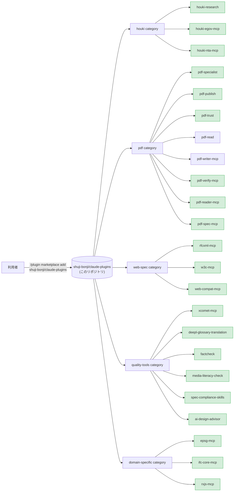

# shuji-bonji's Claude Plugins

[](https://opensource.org/licenses/MIT)

[English](./README.md)

[shuji-bonji](https://github.com/shuji-bonji) が公開する **Claude 拡張 (Skill / MCP server / slash command / sub-agent) の marketplace**。Claude Code と Cowork の両方から `/plugin install` で利用できます。

> Anthropic 公式の [`anthropics/claude-plugins-official`](https://github.com/anthropics/claude-plugins-official) と同じ form factor。`.claude-plugin/marketplace.json` を catalog として、複数 plugin を category 別にまとめています。

## 立ち位置



> 図は構成のみを示します。**version は下の一覧表と `.claude-plugin/marketplace.json` が出所**です（同じ数値を 3 か所に書くと必ず乖離するため、図からは外しています）。

## 収録済み plugin

| plugin                                                                                  | 種別                | category        | version | repo                                     |
| --------------------------------------------------------------------------------------- | ------------------- | --------------- | ------- | ---------------------------------------- |
| [houki-research](https://github.com/shuji-bonji/houki-research-skill)                   | Skill               | houki           | v0.1.0  | `shuji-bonji/houki-research-skill`       |
| [houki-egov-mcp](https://github.com/shuji-bonji/houki-egov-mcp)                         | MCP                 | houki           | v0.3.1  | `shuji-bonji/houki-egov-mcp`             |
| [houki-nta-mcp](https://github.com/shuji-bonji/houki-nta-mcp)                           | MCP                 | houki           | v0.9.5  | `shuji-bonji/houki-nta-mcp`              |
| [pdf-specialist](https://github.com/shuji-bonji/pdf-specialist-plugin)                  | Agent + MCP + Skill | pdf             | v0.7.0  | `shuji-bonji/pdf-specialist-plugin`      |
| [pdf-publish](https://github.com/shuji-bonji/pdf-publish-skill)                         | Skill               | pdf             | v0.7.0  | `shuji-bonji/pdf-publish-skill`          |
| [pdf-trust](https://github.com/shuji-bonji/pdf-trust-skill)                             | Skill               | pdf             | v0.8.0  | `shuji-bonji/pdf-trust-skill`            |
| [pdf-read](https://github.com/shuji-bonji/pdf-read-skill)                               | Skill               | pdf             | v0.2.0  | `shuji-bonji/pdf-read-skill`             |
| [pdf-writer-mcp](https://github.com/shuji-bonji/pdf-writer-mcp)                         | MCP                 | pdf             | v0.21.0 | `shuji-bonji/pdf-writer-mcp`             |
| [pdf-verify-mcp](https://github.com/shuji-bonji/pdf-verify-mcp)                         | MCP                 | pdf             | v0.26.0 | `shuji-bonji/pdf-verify-mcp`             |
| [pdf-reader-mcp](https://github.com/shuji-bonji/pdf-reader-mcp)                         | MCP                 | pdf             | v0.14.0 | `shuji-bonji/pdf-reader-mcp`             |
| [pdf-spec-mcp](https://github.com/shuji-bonji/pdf-spec-mcp)                             | MCP                 | pdf             | v0.6.0  | `shuji-bonji/pdf-spec-mcp`               |
| [rfcxml-mcp](https://github.com/shuji-bonji/rfcxml-mcp)                                 | MCP                 | web-spec        | v0.6.53 | `shuji-bonji/rfcxml-mcp`                 |
| [w3c-mcp](https://github.com/shuji-bonji/w3c-mcp)                                       | MCP                 | web-spec        | v0.3.0  | `shuji-bonji/w3c-mcp`                    |
| [web-compat-mcp](https://github.com/shuji-bonji/web-compat-mcp)                         | MCP                 | web-spec        | v0.3.0  | `shuji-bonji/web-compat-mcp`             |
| [xcomet-mcp](https://github.com/shuji-bonji/xcomet-mcp-server)                          | MCP                 | quality-tools   | v0.7.0  | `shuji-bonji/xcomet-mcp-server`          |
| [deepl-glossary-translation](https://github.com/shuji-bonji/deepl-glossary-translation) | Skill               | quality-tools   | v0.1.0  | `shuji-bonji/deepl-glossary-translation` |
| [factcheck](https://github.com/shuji-bonji/factcheck-skill)                             | Skill               | quality-tools   | v0.1.0  | `shuji-bonji/factcheck-skill`            |
| [media-literacy-check](https://github.com/shuji-bonji/media-literacycheck-skill)        | Skill               | quality-tools   | v0.1.0  | `shuji-bonji/media-literacycheck-skill`  |
| [spec-compliance-skills](https://github.com/shuji-bonji/spec-compliance-skills)         | Skill               | quality-tools   | v0.1.0  | `shuji-bonji/spec-compliance-skills`     |
| [ai-design-advisor](https://github.com/shuji-bonji/ai-design-advisor)                   | Skill               | quality-tools   | v0.1.3  | `shuji-bonji/ai-design-advisor`          |
| [epsg-mcp](https://github.com/shuji-bonji/epsg-mcp)                                     | MCP                 | domain-specific | v0.10.1 | `shuji-bonji/epsg-mcp`                   |
| [ifc-core-mcp](https://github.com/shuji-bonji/ifc-core-mcp)                             | MCP                 | domain-specific | v0.3.0  | `shuji-bonji/ifc-core-mcp`               |
| [rxjs-mcp](https://github.com/shuji-bonji/rxjs-mcp-server)                              | MCP                 | domain-specific | v0.5.3  | `shuji-bonji/rxjs-mcp-server`            |

> `pdf-trust`（受入監査）は `pdf-verify-mcp` を、`pdf-publish`（送り出し）は `pdf-writer-mcp` を、`pdf-read`（読み取り）は `pdf-reader-mcp`（**v0.14.0+ 推奨**）を必須の前提 MCP とします（いずれも marketplace 収録済み）。受入・納品・読み取りを分担する 3 つの Skill なので、用途に応じて必要な MCP と一緒に install してください。

### 利用上の注意

- **`pdf-reader-mcp` v0.14.0 で、テキストを返すツールの出力の形が変わりました。** ページから文字を取り出すことと、その文字が Unicode に変換できるかを観測すること（ISO 32000-2 §9.10.1）は別々の読みで、別々に失敗します。そのため各ツールは **`scope`**（どちらの読みが行われたか）を載せるようになり、**行われなかった読みの項目は `null`（`0` でも `false` でも空文字でもない）**になりました。`read_text` と `read_url` は、ページの配列そのものではなく `{ scope, pages }` を返します。あわせて不具合を 2 つ直しています。`read_url` は**全入力でエラーを返していました**（取得したバイト列を 2 人の読み手に渡していて、先の 1 人が中身を持っていっていた）。`render_page` は、タイリングパターンが天文学的な枚数のタイルを要求するページでサーバごと止まることがありました（いまは別スレッドで 1 ページ 20 秒の予算を置きます）。Skill 経由なら対応済みです —— `pdf-read` **v0.2.0+** と `pdf-publish` **v0.7.0+** が `scope` を読みます。古い Skill を 0.14.0 のサーバに当てると、パスワード付き文書での停止が働きません。
- **PDF family の 4 MCP（2026-08-27 の版）**: `pdf-spec-mcp` v0.6.0 / `pdf-reader-mcp` v0.13.0 / `pdf-verify-mcp` v0.18.0 / `pdf-writer-mcp` v0.21.0 では、ツールは 1 つも増減せず出力も変わりませんが、**呼び方に届く変更が 3 つ**あります。(1) **宣言に無い引数を拒否します** —— それまでは黙って捨てられ、呼び出しは成功していました。(2) **知らないツール名は JSON-RPC エラーで返ります** —— それまではツール結果の `isError: true` でした。`isError` だけを見るクライアントには届かず、`await client.callTool(...)` は解決せずに例外を投げます。(3) `inputSchema` の `$schema` が JSON Schema 2020-12 になり、`pdf-writer-mcp` の `add_bookmarks` は `$ref` の指す先が `#/definitions/` から `#/$defs/` に移ります。加えて **`pdf-reader-mcp` は Node 20 以上が必要**になりました（v0.12.0 までは 18 でも動きました）。Skill 経由の利用（pdf-trust / pdf-publish / pdf-read）は、渡す引数がいずれも宣言済みであることを確認済みで、影響を受けません。
- **pdf-spec-mcp**: ISO 32000 仕様 PDF は利用者が用意し、環境変数 `PDF_SPEC_DIR` で配置先を指定してください。**v0.5.0** から、検索索引と要件の全走査は初回構築のあとディスクにキャッシュされます（`${XDG_CACHE_HOME:-~/.cache}/pdf-spec-mcp`、コーパス全体で約 18 MB。`PDF_SPEC_CACHE_DIR` で置き場所を変更、`PDF_SPEC_CACHE=off` で無効）。セッションごとに起動するサーバプロセスでも、`search_spec` は 6〜14 秒の再構築ではなく 1 秒未満で返ります。`npx -y @shuji-bonji/pdf-spec-mcp@latest --build-cache` で全仕様を事前構築できます。キャッシュは利用者の PDF から利用者の機械上に作る派生物で、配布はしません。
- **pdf-trust**: 前提の `pdf-verify-mcp` **v0.14.0 以前**には、DocTimeStamp（ETSI.RFC3161）の検証が**一律 INDETERMINATE になる欠陥**があります（**v0.14.2 で修正済み**。pyHanko / esig-dss / 官報の 3 系統の検体で確認）。長期保存（B-LTA・電帳法）の受入監査は v0.14.2 以上で行ってください。
- **pdf-trust（リビジョン履歴）**: 前提の `pdf-verify-mcp` **v0.14.2 以前**には、**追えない `/Prev` を「前のセクションは無い」と読み、リビジョンチェーンを完全なものとして報告する欠陥**があります（8 リビジョン 5 署名の検体が「1 リビジョン」と報告されました。**v0.15.0 で修正済み**）。**全履歴を約束する監査** — `legal` / `medical` プロファイル、および「署名後に本文が書き換えられたか」が争点の契約書 — は **v0.15.0 以上**で行ってください。旧版では、短くなった一覧を「一度も変更されていない文書」と見分けられません。
- **pdf-trust（報告書に何を書けるか）**: `pdf-verify-mcp` の変更 3 件は、判定ではなく**書ける内容**に効きます。**v0.15.1** から、適合の判定を出した veraPDF の版が記録されます（`authoritativeValidation.version`）。規則の数（「146 / 146」など）は**同じビルドの実行どうしでしか比べられない**ので、それ以前の報告書は自分の数字を誰が出したのか言えません。**v0.15.2** では `verify_integrity` の説明を直しました —— 返ってきた `revisions` は**全履歴とは限りません**。**v0.16.0** でそれがフィールドになりました（`revisionChain: { status, missing }`）—— それまで信号は `notes` の英文だけで、Skill は「全履歴を約束してよいか」を**散文の照合**で決めていました。「一覧に出てこない = 行われていない」と書けるのは `status: 'complete'` のときだけです。チェーンが切れると残った 1 件が「元版」扱いになり、**機械が読めるフィールドは全部「何も足されていない」と言います**。**pdf-trust v0.6.0 がこのフィールドを読みます**（0.15.x 向けの散文による退避も残してあります）。3 件とも旧版の判定が誤っていたという話ではなく、**報告書に何を書けるか**が変わります。
- **pdf-publish**: 前提の `pdf-writer-mcp` も marketplace に収録済みです（版は上の一覧表を参照）。PDF/A-3b の器付け（`ensure_pdfa`）が入ったのは **v0.15.0**、**PDF/A-4 / PDF/A-4f と PDF 2.0 出力は v0.16.0** です（CSV や JSON を添付した文書は `pdfa-4` ではなく `pdfa-4f` を名乗る必要があります）。**v0.17.0** からは `ensure_pdfa` が `declarationRisks` を返し、**測ると落ちると分かっている宣言**（現状はフォント未埋め込み）を散文の警告に埋めずに名指しします。なお v0.14.0 以前には、Markdown 生成時に `snake_case` の `_` が無警告で消える欠陥があります（[B-17](https://github.com/shuji-bonji/pdf-writer-mcp/blob/main/docs/TASKS.md)・**v0.14.1 で修正済み**）。古い版を掴んでいる場合は、関数名を含む技術文書で出力を確認してください。また v0.18.0 以前には、`%PDF-` が 0 バイト目から始まらない入力に `preserveSignatures: true` を掛けると壊れたファイルを書く欠陥があります（ISO 32000-2 §7.5.2 が認める合法な形で、前置バイトを足す道具の出力がこれに当たります。[B-22](https://github.com/shuji-bonji/pdf-writer-mcp/blob/main/docs/TASKS.md)・**v0.19.0 で修正済み**）。
- **xcomet-mcp**: xCOMET を導入したローカル Python 環境が必要です。環境変数 `XCOMET_PYTHON_PATH` は **v0.6.3 から任意**になりました（venv や既定以外のインタプリタを使う場合のみ指定、未設定なら自動検出）。詳細は [repo の README](https://github.com/shuji-bonji/xcomet-mcp-server) を参照。

## インストール

### Claude Code (個人ユーザー)

```bash
# 1. marketplace を登録 (初回のみ)
/plugin marketplace add shuji-bonji/claude-plugins

# 2. plugin を install
/plugin install houki-research@shuji-bonji

# 例: PDF 信頼性監査 = 受け取った PDF を監査する (pdf-verify-mcp が必須)
/plugin install pdf-verify-mcp@shuji-bonji
/plugin install pdf-trust@shuji-bonji

# 例: PDF 品質ゲート付き納品 = 送り出す PDF を保証する
/plugin install pdf-writer-mcp@shuji-bonji
/plugin install pdf-verify-mcp@shuji-bonji
/plugin install pdf-publish@shuji-bonji
/plugin install pdf-reader-mcp@shuji-bonji

# 例: 読み取りパイプライン = 大きな PDF・読めない PDF から必要な箇所を取り出す
/plugin install pdf-reader-mcp@shuji-bonji   # 必須基盤 (v0.14.0+ 推奨)
/plugin install pdf-read@shuji-bonji
```

### Cowork (個人ユーザー)

個人 Cowork は marketplace URL の追加 UI を持たないため、各 plugin の `.plugin` ファイルを直接アップロードしてください。

1. 各 plugin リポジトリの Releases から `.plugin` ファイルをダウンロード
   例: [houki-research-skill releases](https://github.com/shuji-bonji/houki-research-skill/releases)
2. Claude Desktop → Cowork タブ → サイドバーの **Plugins** → **「Upload plugin」** から選択
3. 有効化

### Cowork Enterprise (組織管理者向け)

組織内で配布する場合は、本 marketplace URL を Organization Settings に登録できます。

1. Organization Settings → Plugins → **「Add plugin」** → Source: **GitHub**
2. URL: `https://github.com/shuji-bonji/claude-plugins`
3. per-user provisioning / auto-install をチームに設定

詳細: [Manage Claude Cowork plugins for your organization](https://support.claude.com/en/articles/13837433-manage-claude-cowork-plugins-for-your-organization)

## category の方針

| category          | 用途                                 | 例                                |
| ----------------- | ------------------------------------ | --------------------------------- |
| `houki`           | 日本の法令・通達・判例調査           | houki-research, houki-egov-mcp 等 |
| `pdf`             | PDF の読取・真正性検証・信頼性監査   | pdf-trust, pdf-verify-mcp 等      |
| `web-spec`        | Web 標準・RFC の参照                 | rfcxml-mcp, w3c-mcp 等            |
| `quality-tools`   | 翻訳評価・ファクトチェック・仕様準拠 | xcomet-mcp, factcheck 等          |
| `domain-specific` | 特定ドメイン (測地・BIM・RxJS)       | epsg-mcp, ifc-core-mcp, rxjs-mcp  |

## ディレクトリ構成

```
claude-plugins/
├── .claude-plugin/
│   └── marketplace.json    # plugin catalog (Anthropic 標準仕様)
├── README.md               # このファイル
└── LICENSE                 # MIT
```

各 plugin の実体は **本リポジトリには含めず**、元リポジトリ (`source: { source: "github", repo: "..." }`) を参照する形を取ります。これにより：

- 各 plugin のリリース粒度を独立に保てる
- marketplace は薄い catalog として運用できる
- バージョン更新は marketplace.json の version 更新だけで済む

## 関連リンク

- [Anthropic 公式の plugin marketplace ドキュメント](https://code.claude.com/docs/en/plugin-marketplaces)
- [`anthropics/claude-plugins-official`](https://github.com/anthropics/claude-plugins-official) — 公式 marketplace の構造リファレンス
- [shuji-bonji の GitHub](https://github.com/shuji-bonji)
- [shuji-bonji の npm](https://www.npmjs.com/~shuji-bonji)

## ライセンス

このリポジトリ (marketplace 自体) は MIT ライセンス。各 plugin のライセンスは元リポジトリを参照してください。
