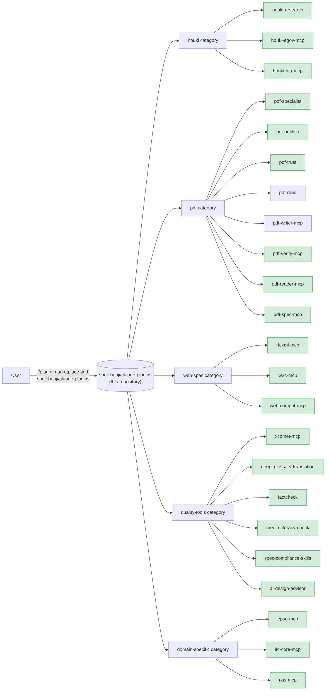

# shuji-bonji's Claude Plugins

[](https://opensource.org/licenses/MIT)

[日本語](./README.ja.md)

A **marketplace of Claude extensions (Skills / MCP servers / slash commands / sub-agents)** published by [shuji-bonji](https://github.com/shuji-bonji). Everything here can be installed with `/plugin install` from both Claude Code and Cowork.

> Same form factor as Anthropic's official [`anthropics/claude-plugins-official`](https://github.com/anthropics/claude-plugins-official). `.claude-plugin/marketplace.json` serves as the catalog, grouping multiple plugins by category.

## Where this fits



> The diagram shows structure only. **Versions come from the table below and `.claude-plugin/marketplace.json`** — writing the same number in three places guarantees drift, so the diagram omits them.

## Included plugins

| plugin                                                                                  | type                | category        | version | repo                                     |
| --------------------------------------------------------------------------------------- | ------------------- | --------------- | ------- | ---------------------------------------- |
| [houki-research](https://github.com/shuji-bonji/houki-research-skill)                   | Skill               | houki           | v0.5.1  | `shuji-bonji/houki-research-skill`       |
| [houki-egov-mcp](https://github.com/shuji-bonji/houki-egov-mcp)                         | MCP                 | houki           | v0.6.0  | `shuji-bonji/houki-egov-mcp`             |
| [houki-nta-mcp](https://github.com/shuji-bonji/houki-nta-mcp)                           | MCP                 | houki           | v0.14.2 | `shuji-bonji/houki-nta-mcp`              |
| [pdf-specialist](https://github.com/shuji-bonji/pdf-specialist-plugin)                  | Agent + MCP + Skill | pdf             | v0.7.0  | `shuji-bonji/pdf-specialist-plugin`      |
| [pdf-publish](https://github.com/shuji-bonji/pdf-publish-skill)                         | Skill               | pdf             | v0.7.0  | `shuji-bonji/pdf-publish-skill`          |
| [pdf-trust](https://github.com/shuji-bonji/pdf-trust-skill)                             | Skill               | pdf             | v0.8.0  | `shuji-bonji/pdf-trust-skill`            |
| [pdf-read](https://github.com/shuji-bonji/pdf-read-skill)                               | Skill               | pdf             | v0.2.0  | `shuji-bonji/pdf-read-skill`             |
| [pdf-writer-mcp](https://github.com/shuji-bonji/pdf-writer-mcp)                         | MCP                 | pdf             | v0.21.0 | `shuji-bonji/pdf-writer-mcp`             |
| [pdf-verify-mcp](https://github.com/shuji-bonji/pdf-verify-mcp)                         | MCP                 | pdf             | v0.26.0 | `shuji-bonji/pdf-verify-mcp`             |
| [pdf-reader-mcp](https://github.com/shuji-bonji/pdf-reader-mcp)                         | MCP                 | pdf             | v0.15.0 | `shuji-bonji/pdf-reader-mcp`             |
| [pdf-spec-mcp](https://github.com/shuji-bonji/pdf-spec-mcp)                             | MCP                 | pdf             | v0.6.0  | `shuji-bonji/pdf-spec-mcp`               |
| [rfcxml-mcp](https://github.com/shuji-bonji/rfcxml-mcp)                                 | MCP                 | web-spec        | v0.6.53 | `shuji-bonji/rfcxml-mcp`                 |
| [w3c-mcp](https://github.com/shuji-bonji/w3c-mcp)                                       | MCP                 | web-spec        | v0.3.0  | `shuji-bonji/w3c-mcp`                    |
| [web-compat-mcp](https://github.com/shuji-bonji/web-compat-mcp)                         | MCP                 | web-spec        | v0.3.0  | `shuji-bonji/web-compat-mcp`             |
| [xcomet-mcp](https://github.com/shuji-bonji/xcomet-mcp-server)                          | MCP                 | quality-tools   | v0.7.0  | `shuji-bonji/xcomet-mcp-server`          |
| [deepl-glossary-translation](https://github.com/shuji-bonji/deepl-glossary-translation) | Skill               | quality-tools   | v0.1.0  | `shuji-bonji/deepl-glossary-translation` |
| [factcheck](https://github.com/shuji-bonji/factcheck-skill)                             | Skill               | quality-tools   | v0.1.0  | `shuji-bonji/factcheck-skill`            |
| [media-literacy-check](https://github.com/shuji-bonji/media-literacycheck-skill)        | Skill               | quality-tools   | v0.1.0  | `shuji-bonji/media-literacycheck-skill`  |
| [spec-compliance-skills](https://github.com/shuji-bonji/spec-compliance-skills)         | Skill               | quality-tools   | v0.1.0  | `shuji-bonji/spec-compliance-skills`     |
| [ai-design-advisor](https://github.com/shuji-bonji/ai-design-advisor)                   | Skill               | quality-tools   | v0.1.3  | `shuji-bonji/ai-design-advisor`          |
| [epsg-mcp](https://github.com/shuji-bonji/epsg-mcp)                                     | MCP                 | domain-specific | v0.10.1 | `shuji-bonji/epsg-mcp`                   |
| [ifc-core-mcp](https://github.com/shuji-bonji/ifc-core-mcp)                             | MCP                 | domain-specific | v0.3.0  | `shuji-bonji/ifc-core-mcp`               |
| [rxjs-mcp](https://github.com/shuji-bonji/rxjs-mcp-server)                              | MCP                 | domain-specific | v0.5.3  | `shuji-bonji/rxjs-mcp-server`            |

> `pdf-trust` (acceptance audit) requires `pdf-verify-mcp`, `pdf-publish` (outbound delivery) requires `pdf-writer-mcp`, and `pdf-read` (reading pipeline) requires `pdf-reader-mcp` (**v0.14.0+ recommended**), as prerequisite MCPs (all are already in the marketplace). The three Skills cover intake, delivery and reading, so install whichever you need together with its required MCP.

### Usage notes

What to check before installing, plus the prerequisites and known defects of each plugin. The background and the full detail live in [docs/NOTES.md](./docs/NOTES.md).

#### All MCP servers

- **Your Node.js version decides whether the servers start at all** (they start through `npx`).

  | Node required | Servers |
  | ------------- | ------- |
  | 20 or later | `pdf-reader-mcp` / `pdf-verify-mcp` / `pdf-writer-mcp` / `pdf-spec-mcp` |
  | 22 or later | `houki-egov-mcp` / `houki-nta-mcp` / `rfcxml-mcp` / `w3c-mcp` / `web-compat-mcp` / `xcomet-mcp` / `epsg-mcp` / `rxjs-mcp` |
  | 22.12 or later | `ifc-core-mcp` |

  Node 20 reached end of life on 2026-04-30. The nine servers that require Node 22 do not start on Node 20.

- **The migration to MCP SDK v2 finished on 2026-09-07 across all thirteen servers.** As long as you pass tool names and arguments as declared, nothing changes for `npx` users. If you call the servers from your own client, argument validation and the shape of errors changed — see [docs/NOTES.md](./docs/NOTES.md#migration-to-mcp-sdk-v2).

#### pdf-trust (acceptance audit, requires `pdf-verify-mcp`)

- **Use `pdf-verify-mcp` v0.21.0 or later.**
- In v0.14.0 and earlier every document timestamp comes back INDETERMINATE (fixed in v0.14.2). Run long-term-preservation audits (B-LTA, denchōhō) on v0.14.2 or later.
- In v0.14.2 and earlier an incomplete revision chain is reported as complete (fixed in v0.15.0). Any audit that promises the full revision history (the `legal` and `medical` profiles, or a contract dispute over changes made after signing) needs v0.15.0 or later.
- v0.15.1 to v0.16.0 change **what a report can claim**, not the verdicts. pdf-trust v0.6.0 and later handle it.
- v0.21.0 changed the top level of the `verify_signatures` and `detect_pades_level` JSON from an array to an object. Direct callers have to go through `.signatures` / `.levels`.

#### pdf-publish (outbound delivery, requires `pdf-writer-mcp`)

- PDF/A-3b containers (`ensure_pdfa`) landed in v0.15.0; PDF/A-4, PDF/A-4f and PDF 2.0 output in v0.16.0 (a document carrying a CSV or JSON attachment must be declared `pdfa-4f`, not `pdfa-4`).
- Since v0.17.0 `ensure_pdfa` returns `declarationRisks`, naming a claim already known to fail validation (today: fonts that are not embedded).
- v0.14.0 and earlier silently drop the `_` of `snake_case` during Markdown generation (fixed in v0.14.1).
- v0.18.0 and earlier write a damaged file when `preserveSignatures: true` is applied to input that does not begin with `%PDF-` at byte 0 (fixed in v0.19.0).

#### pdf-read (reading pipeline, requires `pdf-reader-mcp`)

- **Use `pdf-reader-mcp` v0.14.0 or later with `pdf-read` v0.2.0 or later.**
- v0.14.0 changed the shape of what the text-returning tools return (`scope` was added; `read_text` / `read_url` return `{ scope, pages }`). It also fixes `read_url` erroring on every input and `render_page` hanging the server. `pdf-read` v0.2.0+ and `pdf-publish` v0.7.0+ already read `scope`.
- v0.15.0 changed `objectStats.byType` and `catalog[].type` in `inspect_structure` from pdf-lib class names to COS type names. Callers that read those values have to be updated.

#### pdf-spec-mcp

- You supply the ISO 32000 specification PDFs yourself and point `PDF_SPEC_DIR` at them.
- Since v0.5.0 the search index is cached on disk (about 18 MB; `PDF_SPEC_CACHE_DIR` moves it, `PDF_SPEC_CACHE=off` disables it). `npx -y @shuji-bonji/pdf-spec-mcp@latest --build-cache` warms it up front.

#### xcomet-mcp

- Requires a local Python environment with xCOMET installed.
- `XCOMET_PYTHON_PATH` is optional as of v0.6.3 (the server auto-detects an interpreter when it is unset).

#### w3c-mcp

- v0.2.0 removed `get_spec_dependencies` (upstream never exposed dependency data, so it only ever returned empty arrays; use `get_w3c_spec`).

## Installation

### Claude Code (individual users)

```bash
# 1. Register the marketplace (first time only)
/plugin marketplace add shuji-bonji/claude-plugins

# 2. Install a plugin
/plugin install houki-research@shuji-bonji

# Example: PDF trust audit = audit PDFs you receive (pdf-verify-mcp required)
/plugin install pdf-verify-mcp@shuji-bonji
/plugin install pdf-trust@shuji-bonji

# Example: quality-gated PDF delivery = guarantee the PDFs you send out
/plugin install pdf-writer-mcp@shuji-bonji
/plugin install pdf-verify-mcp@shuji-bonji
/plugin install pdf-publish@shuji-bonji
/plugin install pdf-reader-mcp@shuji-bonji

# Example: reading pipeline = pull what you need out of large or unreadable PDFs
/plugin install pdf-reader-mcp@shuji-bonji   # required foundation (v0.14.0+ recommended)
/plugin install pdf-read@shuji-bonji
```

### Cowork (individual users)

Individual Cowork has no UI for adding a marketplace URL, so upload each plugin's `.plugin` file directly.

1. Download the `.plugin` file from the Releases page of each plugin repository.
   Example: [houki-research-skill releases](https://github.com/shuji-bonji/houki-research-skill/releases)
2. Claude Desktop → Cowork tab → **Plugins** in the sidebar → select **"Upload plugin"**
3. Enable it

### Cowork Enterprise (for organization administrators)

To distribute within an organization, you can register this marketplace URL in Organization Settings.

1. Organization Settings → Plugins → **"Add plugin"** → Source: **GitHub**
2. URL: `https://github.com/shuji-bonji/claude-plugins`
3. Configure per-user provisioning / auto-install for your team

Details: [Manage Claude Cowork plugins for your organization](https://support.claude.com/en/articles/13837433-manage-claude-cowork-plugins-for-your-organization)

## Category policy

| category          | purpose                                                      | examples                             |
| ----------------- | ------------------------------------------------------------ | ------------------------------------ |
| `houki`           | Japanese statutes, administrative notices, case law research | houki-research, houki-egov-mcp, etc. |
| `pdf`             | PDF reading, authenticity verification, trust auditing       | pdf-trust, pdf-verify-mcp, etc.      |
| `web-spec`        | Web standards and RFC reference                              | rfcxml-mcp, w3c-mcp, etc.            |
| `quality-tools`   | Translation evaluation, fact checking, spec compliance       | xcomet-mcp, factcheck, etc.          |
| `domain-specific` | Specific domains (geodesy, BIM, RxJS)                        | epsg-mcp, ifc-core-mcp, rxjs-mcp     |

## Directory layout

```
claude-plugins/
├── .claude-plugin/
│   └── marketplace.json    # plugin catalog (Anthropic standard format)
├── scripts/
│   └── marketplace-version-check.mjs  # checks marketplace.json versions against each repo's plugin.json
├── docs/
│   ├── NOTES.md            # Usage notes (details)
│   └── NOTES.ja.md         # Usage notes (details, Japanese)
├── README.md               # this file
├── README.ja.md            # Japanese version
└── LICENSE                 # MIT
```

`node scripts/marketplace-version-check.mjs` checks that the version listed here matches the version `/plugin install` actually fetches (each repo's `.claude-plugin/plugin.json`); `--write` aligns the catalog to GitHub.

The plugins themselves are **not contained in this repository**; each entry references its source repository (`source: { source: "github", repo: "..." }`). This way:

- each plugin keeps an independent release cadence
- the marketplace stays a thin catalog
- a version bump only requires updating `version` in marketplace.json

## Related links

- [Anthropic's official plugin marketplace documentation](https://code.claude.com/docs/en/plugin-marketplaces)
- [`anthropics/claude-plugins-official`](https://github.com/anthropics/claude-plugins-official) — structural reference for the official marketplace
- [shuji-bonji on GitHub](https://github.com/shuji-bonji)
- [shuji-bonji on npm](https://www.npmjs.com/~shuji-bonji)

## License

This repository (the marketplace itself) is MIT licensed. For each plugin's license, see its source repository.
