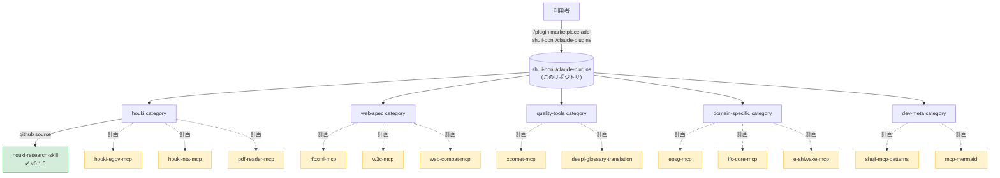

# shuji-bonji's Claude Plugins

[](https://opensource.org/licenses/MIT)

[shuji-bonji](https://github.com/shuji-bonji) が公開する **Claude 拡張 (Skill / MCP server / slash command / sub-agent) の marketplace**。Claude Code と Cowork の両方から `/plugin install` で利用できます。

> Anthropic 公式の [`anthropics/claude-plugins-official`](https://github.com/anthropics/claude-plugins-official) と同じ form factor。`.claude-plugin/marketplace.json` を catalog として、複数 plugin を category 別にまとめています。

## 立ち位置



## 収録済み plugin

| plugin | category | version | repo |
|---|---|---|---|
| [houki-research](https://github.com/shuji-bonji/houki-research-skill) | houki | v0.1.0 | `shuji-bonji/houki-research-skill` |

## 収録予定 plugin (計画中)

| category | plugin 候補 | 元リポジトリ |
|---|---|---|
| `houki` | houki-egov-mcp | [shuji-bonji/houki-egov-mcp](https://github.com/shuji-bonji/houki-egov-mcp) |
| `houki` | houki-nta-mcp | [shuji-bonji/houki-nta-mcp](https://github.com/shuji-bonji/houki-nta-mcp) |
| `houki` | pdf-reader-mcp | [shuji-bonji/pdf-reader-mcp](https://github.com/shuji-bonji/pdf-reader-mcp) |
| `web-spec` | rfcxml-mcp | [shuji-bonji/rfcxml-mcp](https://github.com/shuji-bonji/rfcxml-mcp) |
| `web-spec` | w3c-mcp | [shuji-bonji/w3c-mcp](https://github.com/shuji-bonji/w3c-mcp) |
| `web-spec` | web-compat-mcp | [shuji-bonji/web-compat-mcp](https://github.com/shuji-bonji/web-compat-mcp) |
| `quality-tools` | xcomet-mcp | [shuji-bonji/xcomet-mcp](https://github.com/shuji-bonji/xcomet-mcp) |
| `quality-tools` | deepl-glossary-translation | [shuji-bonji/deepl-glossary-translation](https://github.com/shuji-bonji/deepl-glossary-translation) |
| `quality-tools` | code-review-skill | [shuji-bonji/code-review-skill](https://github.com/shuji-bonji/code-review-skill) |
| `quality-tools` | factcheck-skill | [shuji-bonji/factcheck-skill](https://github.com/shuji-bonji/factcheck-skill) |
| `quality-tools` | media-literacycheck-skill | [shuji-bonji/media-literacycheck-skill](https://github.com/shuji-bonji/media-literacycheck-skill) |
| `quality-tools` | spec-compliance-skills | [shuji-bonji/spec-compliance-skills](https://github.com/shuji-bonji/spec-compliance-skills) |
| `domain-specific` | epsg-mcp | [shuji-bonji/epsg-mcp](https://github.com/shuji-bonji/epsg-mcp) |
| `domain-specific` | ifc-core-mcp | [shuji-bonji/ifc-core-mcp](https://github.com/shuji-bonji/ifc-core-mcp) |
| `domain-specific` | e-shiwake-mcp | [shuji-bonji/e-shiwake-mcp](https://github.com/shuji-bonji/e-shiwake-mcp) |
| `domain-specific` | labor-law-mcp | [shuji-bonji/labor-law-mcp](https://github.com/shuji-bonji/labor-law-mcp) |
| `domain-specific` | tax-law-mcp | [shuji-bonji/tax-law-mcp](https://github.com/shuji-bonji/tax-law-mcp) |
| `dev-meta` | shuji-mcp-patterns | [shuji-bonji/shuji-mcp-patterns](https://github.com/shuji-bonji/shuji-mcp-patterns) |
| `dev-meta` | mcp-mermaid | [shuji-bonji/mcp-mermaid](https://github.com/shuji-bonji/mcp-mermaid) |

各 plugin は元リポジトリで `.claude-plugin/plugin.json` を整備した上で、本 marketplace に順次追加していきます。

## インストール

### Claude Code

```bash
# 1. marketplace を登録 (初回のみ)
/plugin marketplace add shuji-bonji/claude-plugins

# 2. plugin を install
/plugin install houki-research@shuji-bonji
```

### Cowork

Cowork mode の Settings から marketplace URL を追加：

```
https://github.com/shuji-bonji/claude-plugins
```

その後、Customize → Plugins から `houki-research` を install。

> Cowork 用の `.plugin` (zip) ファイルは各 plugin の元リポジトリの GitHub Release からも取得できます。例: [houki-research-skill releases](https://github.com/shuji-bonji/houki-research-skill/releases)

## category の方針

| category | 用途 | 例 |
|---|---|---|
| `houki` | 日本の法令・通達・判例調査 | houki-research, houki-egov-mcp 等 |
| `web-spec` | Web 標準・RFC の参照 | rfcxml-mcp, w3c-mcp 等 |
| `quality-tools` | コードレビュー・翻訳評価・ファクトチェック | xcomet-mcp, code-review-skill 等 |
| `domain-specific` | 特定ドメイン (測地・BIM・会計・労務) | epsg-mcp, ifc-core-mcp 等 |
| `dev-meta` | MCP / Skill 開発支援 | shuji-mcp-patterns 等 |

## ディレクトリ構成

```
claude-plugins/
├── .claude-plugin/
│   └── marketplace.json    # plugin catalog (Anthropic 標準仕様)
├── README.md               # このファイル
└── LICENSE                 # MIT
```

各 plugin の実体は **本リポジトリには含めず**、元リポジトリ (`source: { source: "github", repo: "..." }`) を参照する形を取ります。これにより：

- 各 plugin のリリース粒度を独立に保てる
- marketplace は薄い catalog として運用できる
- バージョン更新は marketplace.json の version 更新だけで済む

## 関連リンク

- [Anthropic 公式の plugin marketplace ドキュメント](https://code.claude.com/docs/en/plugin-marketplaces)
- [`anthropics/claude-plugins-official`](https://github.com/anthropics/claude-plugins-official) — 公式 marketplace の構造リファレンス
- [shuji-bonji の GitHub](https://github.com/shuji-bonji)
- [shuji-bonji の npm](https://www.npmjs.com/~shuji-bonji)

## ライセンス

このリポジトリ (marketplace 自体) は MIT ライセンス。各 plugin のライセンスは元リポジトリを参照してください。
