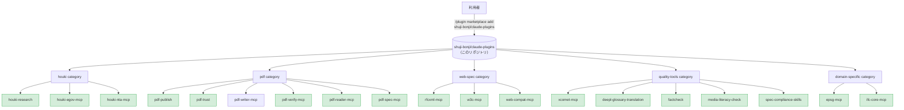

# shuji-bonji's Claude Plugins

[](https://opensource.org/licenses/MIT)

[shuji-bonji](https://github.com/shuji-bonji) が公開する **Claude 拡張 (Skill / MCP server / slash command / sub-agent) の marketplace**。Claude Code と Cowork の両方から `/plugin install` で利用できます。

> Anthropic 公式の [`anthropics/claude-plugins-official`](https://github.com/anthropics/claude-plugins-official) と同じ form factor。`.claude-plugin/marketplace.json` を catalog として、複数 plugin を category 別にまとめています。

## 立ち位置



> 図は構成のみを示します。**version は下の一覧表と `.claude-plugin/marketplace.json` が出所**です（同じ数値を 3 か所に書くと必ず乖離するため、図からは外しています）。

## 収録済み plugin

| plugin | 種別 | category | version | repo |
|---|---|---|---|---|
| [houki-research](https://github.com/shuji-bonji/houki-research-skill) | Skill | houki | v0.1.0 | `shuji-bonji/houki-research-skill` |
| [houki-egov-mcp](https://github.com/shuji-bonji/houki-egov-mcp) | MCP | houki | v0.3.1 | `shuji-bonji/houki-egov-mcp` |
| [houki-nta-mcp](https://github.com/shuji-bonji/houki-nta-mcp) | MCP | houki | v0.9.5 | `shuji-bonji/houki-nta-mcp` |
| [pdf-publish](https://github.com/shuji-bonji/pdf-publish-skill) | Skill | pdf | v0.3.1 | `shuji-bonji/pdf-publish-skill` |
| [pdf-trust](https://github.com/shuji-bonji/pdf-trust-skill) | Skill | pdf | v0.2.0 | `shuji-bonji/pdf-trust-skill` |
| [pdf-writer-mcp](https://github.com/shuji-bonji/pdf-writer-mcp) | MCP | pdf | v0.15.0 | `shuji-bonji/pdf-writer-mcp` |
| [pdf-verify-mcp](https://github.com/shuji-bonji/pdf-verify-mcp) | MCP | pdf | v0.7.0 | `shuji-bonji/pdf-verify-mcp` |
| [pdf-reader-mcp](https://github.com/shuji-bonji/pdf-reader-mcp) | MCP | pdf | v0.9.1 | `shuji-bonji/pdf-reader-mcp` |
| [pdf-spec-mcp](https://github.com/shuji-bonji/pdf-spec-mcp) | MCP | pdf | v0.4.4 | `shuji-bonji/pdf-spec-mcp` |
| [rfcxml-mcp](https://github.com/shuji-bonji/rfcxml-mcp) | MCP | web-spec | v0.5.4 | `shuji-bonji/rfcxml-mcp` |
| [w3c-mcp](https://github.com/shuji-bonji/w3c-mcp) | MCP | web-spec | v0.1.12 | `shuji-bonji/w3c-mcp` |
| [web-compat-mcp](https://github.com/shuji-bonji/web-compat-mcp) | MCP | web-spec | v0.1.5 | `shuji-bonji/web-compat-mcp` |
| [xcomet-mcp](https://github.com/shuji-bonji/xcomet-mcp-server) | MCP | quality-tools | v0.6.2 | `shuji-bonji/xcomet-mcp-server` |
| [deepl-glossary-translation](https://github.com/shuji-bonji/deepl-glossary-translation) | Skill | quality-tools | v0.1.0 | `shuji-bonji/deepl-glossary-translation` |
| [factcheck](https://github.com/shuji-bonji/factcheck-skill) | Skill | quality-tools | v0.1.0 | `shuji-bonji/factcheck-skill` |
| [media-literacy-check](https://github.com/shuji-bonji/media-literacycheck-skill) | Skill | quality-tools | v0.1.0 | `shuji-bonji/media-literacycheck-skill` |
| [spec-compliance-skills](https://github.com/shuji-bonji/spec-compliance-skills) | Skill | quality-tools | v0.1.0 | `shuji-bonji/spec-compliance-skills` |
| [epsg-mcp](https://github.com/shuji-bonji/epsg-mcp) | MCP | domain-specific | v0.9.10 | `shuji-bonji/epsg-mcp` |
| [ifc-core-mcp](https://github.com/shuji-bonji/ifc-core-mcp) | MCP | domain-specific | v0.2.2 | `shuji-bonji/ifc-core-mcp` |

> `pdf-trust`（受入監査）は `pdf-verify-mcp` を、`pdf-publish`（送り出し）は `pdf-writer-mcp` を必須の前提 MCP とします（いずれも marketplace 収録済み）。対になる 2 つの Skill なので、用途に応じて必要な MCP と一緒に install してください。

### 利用上の注意

- **pdf-spec-mcp**: ISO 32000 仕様 PDF は利用者が用意し、環境変数 `PDF_SPEC_DIR` で配置先を指定してください。
- **pdf-publish**: 前提の `pdf-writer-mcp` も marketplace に収録済みです（**v0.15.0**）。PDF/A-3b の器付け（`ensure_pdfa`）はこの版から使えます。なお v0.14.0 以前には、Markdown 生成時に `snake_case` の `_` が無警告で消える欠陥があります（[B-17](https://github.com/shuji-bonji/pdf-writer-mcp/blob/main/docs/TASKS.md)・**v0.14.1 で修正済み**）。古い版を掴んでいる場合は、関数名を含む技術文書で出力を確認してください。
- **xcomet-mcp**: xCOMET 推論用のローカル Python 環境が必要です（環境変数 `XCOMET_PYTHON_PATH`）。詳細は [repo の README](https://github.com/shuji-bonji/xcomet-mcp-server) を参照。

## インストール

### Claude Code (個人ユーザー)

```bash
# 1. marketplace を登録 (初回のみ)
/plugin marketplace add shuji-bonji/claude-plugins

# 2. plugin を install
/plugin install houki-research@shuji-bonji

# 例: PDF 信頼性監査 = 受け取った PDF を監査する (pdf-verify-mcp が必須)
/plugin install pdf-verify-mcp@shuji-bonji
/plugin install pdf-trust@shuji-bonji

# 例: PDF 品質ゲート付き納品 = 送り出す PDF を保証する
/plugin install pdf-writer-mcp@shuji-bonji
/plugin install pdf-verify-mcp@shuji-bonji
/plugin install pdf-publish@shuji-bonji
/plugin install pdf-reader-mcp@shuji-bonji
```

### Cowork (個人ユーザー)

個人 Cowork は marketplace URL の追加 UI を持たないため、各 plugin の `.plugin` ファイルを直接アップロードしてください。

1. 各 plugin リポジトリの Releases から `.plugin` ファイルをダウンロード
   例: [houki-research-skill releases](https://github.com/shuji-bonji/houki-research-skill/releases)
2. Claude Desktop → Cowork タブ → サイドバーの **Plugins** → **「Upload plugin」** から選択
3. 有効化

### Cowork Enterprise (組織管理者向け)

組織内で配布する場合は、本 marketplace URL を Organization Settings に登録できます。

1. Organization Settings → Plugins → **「Add plugin」** → Source: **GitHub**
2. URL: `https://github.com/shuji-bonji/claude-plugins`
3. per-user provisioning / auto-install をチームに設定

詳細: [Manage Claude Cowork plugins for your organization](https://support.claude.com/en/articles/13837433-manage-claude-cowork-plugins-for-your-organization)

## category の方針

| category | 用途 | 例 |
|---|---|---|
| `houki` | 日本の法令・通達・判例調査 | houki-research, houki-egov-mcp 等 |
| `pdf` | PDF の読取・真正性検証・信頼性監査 | pdf-trust, pdf-verify-mcp 等 |
| `web-spec` | Web 標準・RFC の参照 | rfcxml-mcp, w3c-mcp 等 |
| `quality-tools` | 翻訳評価・ファクトチェック・仕様準拠 | xcomet-mcp, factcheck 等 |
| `domain-specific` | 特定ドメイン (測地・BIM) | epsg-mcp, ifc-core-mcp 等 |

## ディレクトリ構成

```
claude-plugins/
├── .claude-plugin/
│   └── marketplace.json    # plugin catalog (Anthropic 標準仕様)
├── README.md               # このファイル
└── LICENSE                 # MIT
```

各 plugin の実体は **本リポジトリには含めず**、元リポジトリ (`source: { source: "github", repo: "..." }`) を参照する形を取ります。これにより：

- 各 plugin のリリース粒度を独立に保てる
- marketplace は薄い catalog として運用できる
- バージョン更新は marketplace.json の version 更新だけで済む

## 関連リンク

- [Anthropic 公式の plugin marketplace ドキュメント](https://code.claude.com/docs/en/plugin-marketplaces)
- [`anthropics/claude-plugins-official`](https://github.com/anthropics/claude-plugins-official) — 公式 marketplace の構造リファレンス
- [shuji-bonji の GitHub](https://github.com/shuji-bonji)
- [shuji-bonji の npm](https://www.npmjs.com/~shuji-bonji)

## ライセンス

このリポジトリ (marketplace 自体) は MIT ライセンス。各 plugin のライセンスは元リポジトリを参照してください。
