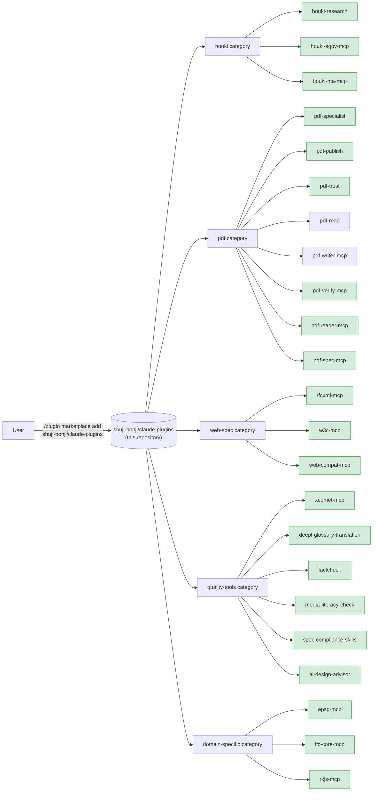

# shuji-bonji's Claude Plugins

[](https://opensource.org/licenses/MIT)

[日本語](./README.ja.md)

A **marketplace of Claude extensions (Skills / MCP servers / slash commands / sub-agents)** published by [shuji-bonji](https://github.com/shuji-bonji). Everything here can be installed with `/plugin install` from both Claude Code and Cowork.

> Same form factor as Anthropic's official [`anthropics/claude-plugins-official`](https://github.com/anthropics/claude-plugins-official). `.claude-plugin/marketplace.json` serves as the catalog, grouping multiple plugins by category.

## Where this fits



> The diagram shows structure only. **Versions come from the table below and `.claude-plugin/marketplace.json`** — writing the same number in three places guarantees drift, so the diagram omits them.

## Included plugins

| plugin                                                                                  | type                | category        | version | repo                                     |
| --------------------------------------------------------------------------------------- | ------------------- | --------------- | ------- | ---------------------------------------- |
| [houki-research](https://github.com/shuji-bonji/houki-research-skill)                   | Skill               | houki           | v0.1.0  | `shuji-bonji/houki-research-skill`       |
| [houki-egov-mcp](https://github.com/shuji-bonji/houki-egov-mcp)                         | MCP                 | houki           | v0.3.1  | `shuji-bonji/houki-egov-mcp`             |
| [houki-nta-mcp](https://github.com/shuji-bonji/houki-nta-mcp)                           | MCP                 | houki           | v0.9.5  | `shuji-bonji/houki-nta-mcp`              |
| [pdf-specialist](https://github.com/shuji-bonji/pdf-specialist-plugin)                  | Agent + MCP + Skill | pdf             | v0.7.0  | `shuji-bonji/pdf-specialist-plugin`      |
| [pdf-publish](https://github.com/shuji-bonji/pdf-publish-skill)                         | Skill               | pdf             | v0.7.0  | `shuji-bonji/pdf-publish-skill`          |
| [pdf-trust](https://github.com/shuji-bonji/pdf-trust-skill)                             | Skill               | pdf             | v0.8.0  | `shuji-bonji/pdf-trust-skill`            |
| [pdf-read](https://github.com/shuji-bonji/pdf-read-skill)                               | Skill               | pdf             | v0.2.0  | `shuji-bonji/pdf-read-skill`             |
| [pdf-writer-mcp](https://github.com/shuji-bonji/pdf-writer-mcp)                         | MCP                 | pdf             | v0.21.0 | `shuji-bonji/pdf-writer-mcp`             |
| [pdf-verify-mcp](https://github.com/shuji-bonji/pdf-verify-mcp)                         | MCP                 | pdf             | v0.26.0 | `shuji-bonji/pdf-verify-mcp`             |
| [pdf-reader-mcp](https://github.com/shuji-bonji/pdf-reader-mcp)                         | MCP                 | pdf             | v0.14.0 | `shuji-bonji/pdf-reader-mcp`             |
| [pdf-spec-mcp](https://github.com/shuji-bonji/pdf-spec-mcp)                             | MCP                 | pdf             | v0.6.0  | `shuji-bonji/pdf-spec-mcp`               |
| [rfcxml-mcp](https://github.com/shuji-bonji/rfcxml-mcp)                                 | MCP                 | web-spec        | v0.6.0  | `shuji-bonji/rfcxml-mcp`                 |
| [w3c-mcp](https://github.com/shuji-bonji/w3c-mcp)                                       | MCP                 | web-spec        | v0.1.12 | `shuji-bonji/w3c-mcp`                    |
| [web-compat-mcp](https://github.com/shuji-bonji/web-compat-mcp)                         | MCP                 | web-spec        | v0.1.5  | `shuji-bonji/web-compat-mcp`             |
| [xcomet-mcp](https://github.com/shuji-bonji/xcomet-mcp-server)                          | MCP                 | quality-tools   | v0.7.0  | `shuji-bonji/xcomet-mcp-server`          |
| [deepl-glossary-translation](https://github.com/shuji-bonji/deepl-glossary-translation) | Skill               | quality-tools   | v0.1.0  | `shuji-bonji/deepl-glossary-translation` |
| [factcheck](https://github.com/shuji-bonji/factcheck-skill)                             | Skill               | quality-tools   | v0.1.0  | `shuji-bonji/factcheck-skill`            |
| [media-literacy-check](https://github.com/shuji-bonji/media-literacycheck-skill)        | Skill               | quality-tools   | v0.1.0  | `shuji-bonji/media-literacycheck-skill`  |
| [spec-compliance-skills](https://github.com/shuji-bonji/spec-compliance-skills)         | Skill               | quality-tools   | v0.1.0  | `shuji-bonji/spec-compliance-skills`     |
| [ai-design-advisor](https://github.com/shuji-bonji/ai-design-advisor)                   | Skill               | quality-tools   | v0.1.0  | `shuji-bonji/ai-design-advisor`          |
| [epsg-mcp](https://github.com/shuji-bonji/epsg-mcp)                                     | MCP                 | domain-specific | v0.9.10 | `shuji-bonji/epsg-mcp`                   |
| [ifc-core-mcp](https://github.com/shuji-bonji/ifc-core-mcp)                             | MCP                 | domain-specific | v0.2.2  | `shuji-bonji/ifc-core-mcp`               |
| [rxjs-mcp](https://github.com/shuji-bonji/rxjs-mcp-server)                              | MCP                 | domain-specific | v0.5.3  | `shuji-bonji/rxjs-mcp-server`            |

> `pdf-trust` (acceptance audit) requires `pdf-verify-mcp`, `pdf-publish` (outbound delivery) requires `pdf-writer-mcp`, and `pdf-read` (reading pipeline) requires `pdf-reader-mcp` (**v0.14.0+ recommended**), as prerequisite MCPs (all are already in the marketplace). The three Skills cover intake, delivery and reading, so install whichever you need together with its required MCP.

### Usage notes

- **`pdf-reader-mcp` v0.14.0 changes the shape of what the text-returning tools return.** Taking the characters off a page and observing whether those characters have a route to Unicode (ISO 32000-2 §9.10.1) are separate readings that fail separately, so every such tool now carries `scope` saying which of them were done, and **a field whose reading did not happen is `null` — never `0`, `false` or `""`**. `read_text` and `read_url` return `{ scope, pages }` where they returned a bare array of pages. Two defects are fixed with it: `read_url` used to return an error for **every** input (the fetched bytes were handed to two readers, and the first took them away), and `render_page` could stop the server for good on a page whose tiling pattern asks for an astronomical number of tiles — it now runs off the main thread with a 20-second budget per page. Through the Skills this is handled for you: use `pdf-read` **v0.2.0+** and `pdf-publish` **v0.7.0+**, which read `scope`. On the older Skills against a 0.14.0 server, the stop for a password-protected document does not fire.
- **The four PDF family MCP servers (the 2026-08-27 releases)**: `pdf-spec-mcp` v0.6.0, `pdf-reader-mcp` v0.13.0, `pdf-verify-mcp` v0.18.0 and `pdf-writer-mcp` v0.21.0 neither gain nor lose a tool, and no tool's output changed — but **three things reach callers**. (1) **An argument the input schema does not declare is now rejected**; until now it was silently dropped and the call ran. (2) **A call naming a tool the server does not have comes back as a JSON-RPC error**, where it used to be a tool result with `isError: true`; a client that only reads `isError` will not see it, and `await client.callTool(...)` throws instead of resolving. (3) `inputSchema` now declares `$schema` as JSON Schema 2020-12, and `pdf-writer-mcp`'s `add_bookmarks` moves its `$ref` target from `#/definitions/` to `#/$defs/`. `pdf-reader-mcp` also **requires Node 20 or later** now (v0.12.0 still ran on 18). Using them through the Skills (pdf-trust / pdf-publish / pdf-read) is unaffected — every argument those Skills pass was checked against the declared schemas.
- **pdf-spec-mcp**: You must supply the ISO 32000 specification PDFs yourself and point the `PDF_SPEC_DIR` environment variable at their location. Since **v0.5.0** the search index and the full requirements scan are cached on disk after their first build (`${XDG_CACHE_HOME:-~/.cache}/pdf-spec-mcp`, about 18 MB for the whole corpus; `PDF_SPEC_CACHE_DIR` moves it, `PDF_SPEC_CACHE=off` disables it), so a server process started for a new session answers `search_spec` in well under a second instead of rebuilding for 6–14 s. `npx -y @shuji-bonji/pdf-spec-mcp@latest --build-cache` warms every spec up front. The cache is derived from your own copy of the PDFs and stays on your machine.
- **pdf-trust**: Its prerequisite `pdf-verify-mcp` had a defect in **v0.14.0 and earlier** where every document timestamp (ETSI.RFC3161) came back **INDETERMINATE** (**fixed in v0.14.2**; confirmed against three independent specimen families — pyHanko, esig/dss, and the Japanese official gazette). Run long-term-preservation audits (B-LTA, denchōhō) on v0.14.2 or later.
- **pdf-trust (revision history)**: In `pdf-verify-mcp` **v0.14.2 and earlier**, a `/Prev` link that could not be followed was read as "there is no previous cross-reference section", so the revision chain was reported as complete when it was not — a specimen with 8 revisions and 5 signatures came back as having one (**fixed in v0.15.0**). Any audit whose report promises the _full_ revision history — the `legal` and `medical` profiles, and any contract dispute over whether the body text was altered after signing — must be run on **v0.15.0 or later**. On earlier versions the shortened list cannot be distinguished from a document that was never changed.
- **pdf-trust (what a report can claim)**: three `pdf-verify-mcp` changes affect wording rather than verdicts. **v0.15.1** records which veraPDF build decided a conformance result (`authoritativeValidation.version`) — a rule count such as "146 / 146" is only comparable across runs of the same build, so a report from an earlier version cannot say what produced its numbers. **v0.15.2** corrects the `verify_integrity` description: a returned `revisions` list can be a part of the history rather than all of it. **v0.16.0** makes that a field, `revisionChain: { status, missing }` — before it the only signal was English prose in `notes`, so the skill decided whether it could promise a _full_ revision history by matching sentences. Only `status: 'complete'` lets a report say "this change does not appear in the list, so it was not made"; with a cut chain the one surviving revision is reported as the original, and every machine-readable field then reads as "nothing was appended". **pdf-trust v0.6.0 reads the field**, and keeps the prose fallback for 0.15.x. None of the three is a defect in the verdicts of earlier versions; all three change what a report can honestly claim.
- **pdf-publish**: Its prerequisite `pdf-writer-mcp` is also in the marketplace (see the table above for the version). PDF/A-3b container support (`ensure_pdfa`) landed in **v0.15.0**; **PDF/A-4 and PDF/A-4f, plus PDF 2.0 output, landed in v0.16.0** (a document carrying a CSV or JSON attachment has to be declared `pdfa-4f`, not `pdfa-4`). Since **v0.17.0** `ensure_pdfa` also reports `declarationRisks` — a claim that is already known to fail validation (today: fonts that are not embedded) is named, instead of being left inside the prose warning. Note that v0.14.0 and earlier have a defect where `_` in `snake_case` is silently dropped during Markdown generation ([B-17](https://github.com/shuji-bonji/pdf-writer-mcp/blob/main/docs/TASKS.md) — **fixed in v0.14.1**). If you are pinned to an older release, check the output of any technical document that contains function names. v0.18.0 and earlier also have a defect where `preserveSignatures: true` writes a damaged file when the input does not begin with `%PDF-` at byte 0 — legal per ISO 32000-2 §7.5.2, and produced by any tool that prepends bytes ([B-22](https://github.com/shuji-bonji/pdf-writer-mcp/blob/main/docs/TASKS.md) — **fixed in v0.19.0**).
- **xcomet-mcp**: Requires a local Python environment with xCOMET installed. `XCOMET_PYTHON_PATH` is **optional** as of **v0.6.3** — set it only when you use a venv or a non-default interpreter; otherwise the server auto-detects one. See the [repo README](https://github.com/shuji-bonji/xcomet-mcp-server) for details.

## Installation

### Claude Code (individual users)

```bash
# 1. Register the marketplace (first time only)
/plugin marketplace add shuji-bonji/claude-plugins

# 2. Install a plugin
/plugin install houki-research@shuji-bonji

# Example: PDF trust audit = audit PDFs you receive (pdf-verify-mcp required)
/plugin install pdf-verify-mcp@shuji-bonji
/plugin install pdf-trust@shuji-bonji

# Example: quality-gated PDF delivery = guarantee the PDFs you send out
/plugin install pdf-writer-mcp@shuji-bonji
/plugin install pdf-verify-mcp@shuji-bonji
/plugin install pdf-publish@shuji-bonji
/plugin install pdf-reader-mcp@shuji-bonji

# Example: reading pipeline = pull what you need out of large or unreadable PDFs
/plugin install pdf-reader-mcp@shuji-bonji   # required foundation (v0.14.0+ recommended)
/plugin install pdf-read@shuji-bonji
```

### Cowork (individual users)

Individual Cowork has no UI for adding a marketplace URL, so upload each plugin's `.plugin` file directly.

1. Download the `.plugin` file from the Releases page of each plugin repository.
   Example: [houki-research-skill releases](https://github.com/shuji-bonji/houki-research-skill/releases)
2. Claude Desktop → Cowork tab → **Plugins** in the sidebar → select **"Upload plugin"**
3. Enable it

### Cowork Enterprise (for organization administrators)

To distribute within an organization, you can register this marketplace URL in Organization Settings.

1. Organization Settings → Plugins → **"Add plugin"** → Source: **GitHub**
2. URL: `https://github.com/shuji-bonji/claude-plugins`
3. Configure per-user provisioning / auto-install for your team

Details: [Manage Claude Cowork plugins for your organization](https://support.claude.com/en/articles/13837433-manage-claude-cowork-plugins-for-your-organization)

## Category policy

| category          | purpose                                                      | examples                             |
| ----------------- | ------------------------------------------------------------ | ------------------------------------ |
| `houki`           | Japanese statutes, administrative notices, case law research | houki-research, houki-egov-mcp, etc. |
| `pdf`             | PDF reading, authenticity verification, trust auditing       | pdf-trust, pdf-verify-mcp, etc.      |
| `web-spec`        | Web standards and RFC reference                              | rfcxml-mcp, w3c-mcp, etc.            |
| `quality-tools`   | Translation evaluation, fact checking, spec compliance       | xcomet-mcp, factcheck, etc.          |
| `domain-specific` | Specific domains (geodesy, BIM, RxJS)                        | epsg-mcp, ifc-core-mcp, rxjs-mcp     |

## Directory layout

```
claude-plugins/
├── .claude-plugin/
│   └── marketplace.json    # plugin catalog (Anthropic standard format)
├── README.md               # this file
└── LICENSE                 # MIT
```

The plugins themselves are **not contained in this repository**; each entry references its source repository (`source: { source: "github", repo: "..." }`). This way:

- each plugin keeps an independent release cadence
- the marketplace stays a thin catalog
- a version bump only requires updating `version` in marketplace.json

## Related links

- [Anthropic's official plugin marketplace documentation](https://code.claude.com/docs/en/plugin-marketplaces)
- [`anthropics/claude-plugins-official`](https://github.com/anthropics/claude-plugins-official) — structural reference for the official marketplace
- [shuji-bonji on GitHub](https://github.com/shuji-bonji)
- [shuji-bonji on npm](https://www.npmjs.com/~shuji-bonji)

## License

This repository (the marketplace itself) is MIT licensed. For each plugin's license, see its source repository.
